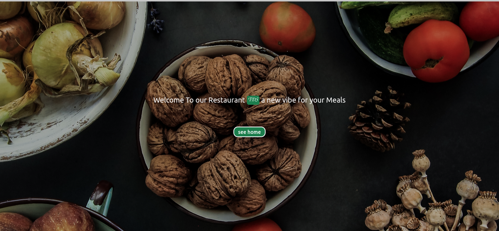
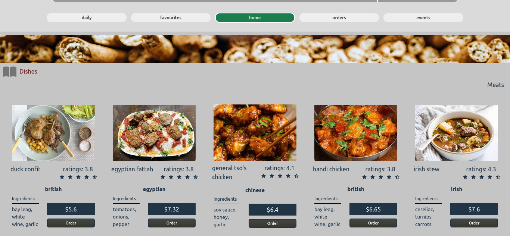

#  TDS Restaurant  

This little website give you a small inside about how will look your online **furniture shop** website. Hope we will enjoy it !

 View live

- Clone the repository
  [ Link repository](https://github.com/BeinRain06/Tds_Restaurant_three.git)
- **run** the command **npm run dev** both into the terminal directory

  `tds-restaurant/server` 
 & `tds-restaurant/client`

##  Features   

- Order 0ne to 3 books once
  >
- Initialize order until payment
  >
- Fourth Meal Game
  >
- Rate meals
  >
- Get Faourites Meals
   

- 
     
     
- 

[view code](https://github.com/BeinRain06/Tds_Restaurant_three.git)

   <h3 style="color:#333; font-weight:bold">1.Process to Clone Repository</h3>

   

     
A / Open Command Terminal on your computer

     

          
Windows Users

          

            Select the <strong>Start menu</strong> (the Windows icon) on the taskbar, or press the Windows key. Type <strong>cmd</strong>.
          

          
Open ** Two Terminal ** Command

     

     

          
Linux/Ubuntu Users

          

            Press <strong>CTRL + ALT + T</strong> simultaneously (while being on your desktop page) to open the terminal command
          

           
Open ** Two Terminal ** Command

     

      

          
MAC Users

          

            Click the <strong>Launchpad icon</strong> in the Dock, type <strong>Terminal</strong> in the search field, then click <strong>Terminal</strong>.
          

           
Open ** Two Terminal ** Command

      

      
B / Terminal 
      

      

          
Windows Users, Linux, Mac

          

            
1
 Enter
cd Desktop
 to shift into the <strong style="margin:0 0.25rem">Desktop</strong> directory of your computer.
For Mac 
cd ~/Desktop/

          

          

            
2
 TYPE
mkdir tds-restaurant
 to create a folder named <strong style="margin:0 0.25rem">tds-restaurant</strong> under desktop page
          
 
          

            
3
 TYPE
cd tds-restaurant
 to move into <strong style="margin:0 0.25rem">tds-restaurant</strong> folder
          
 
          

            
4
 ENTER
git clone https://github.com/BeinRain06/Tds_Restaurant_three.git .
to clone the repository <strong>directly into the folder</strong> created above. Don't forget the dot <strong style="width:3rem;margin:0 0.5rem; padding:0.25rem;color:#fff; background-color:#333; text-align:center;"> . </strong> at the end of this link.
          
   
          

            
5
 WAIT
process compiling
 until the end <strong style="margin:0 0.25rem">( Terminal Command )</strong>
          

          

            
6
 TYPE
cd server
 to move into <strong style="margin:0 0.25rem">server folder</strong> of the app
          
 
          

            
7
 INSTALL 
dependencie's app
 to enable <strong style="margin:0 0.25rem">local running</strong> of the app
          

          

            
7.1
 ENTER
npm install bcryptjs cookie-parser body-parser cors
 and wait the end<strong style="margin:0 0.25rem"> installation</strong>
          
 
          

            
7.2
 ENTER
npm install dotenv express express-jwt jsonwebtoken 
 and wait the end<strong style="margin:0 0.25rem"> installation</strong>
          

          

            
7.3
 ENTER
npm install moment mongoose multer qs nodemon
 and wait the end<strong style="margin:0 0.25rem"> installation</strong>
          

          

            
7.4
 ENTER
npm install -D @babel/cli @babel/core @babel/node @babel/preset-env
 and wait the end<strong style="margin:0 0.25rem"> installation</strong>
          

          

            
7.5
 ENTER
npm install -D babel-plugin-module-resolver concurrently nodemon
 and wait the end<strong style="margin:0 0.25rem"> installation</strong>
          

          

            
8
 TYPE sucessively in your <strong>Second Terminal</strong> open  
cd Desktop
 
cd tds-restaurant
 
cd client
  
to move into <strong style="margin:0 0.25rem">client app</strong> folder

          

          

            
9
 TYPE both
npm run dev
 in the<strong style="margin:0 0.25rem"> First Terminal</strong>and  <strong style="margin:0 0.25rem"> Second Terminal</strong>  Open
          
  
          

            
10
 GO to your browser . Ensures you have internet connection. Type
http://localhost:5173
 and  <strong style="margin:0 0.25rem">  finally</strong> open the app on the<strong style="margin:0 0.25rem"> Browser </strong>
          

          

            
11
 
Thanks You !
 
          
        
     

   

